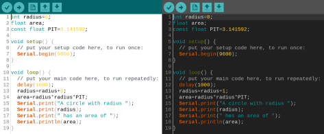

# Dark Arduino Theme 

Works for the Java version of Arduino. At the time of writing that is version 1.8.19

\- \- \-

### INSTALLATION  

This is included as an option when installing Arduino from the Pi-Apps store. (click the image below)  

* Mac users should look in `/Applications/Arduino.app/Contents/Java/lib` and replace the `theme` folder inside.  
* Windows is located in `C:\Program Files (x86)\Arduino\lib`.  
* Linux will be in `/usr/share/arduino/lib/` – note you may need to install the Arduino IDE from the Arduino site, not a place like Ubuntu Software  

To darken the launch loading image, copy the files from the `images` folder to Arduino's `lib` folder. the images should be placed alongside the `themes` folder, not inside of it.
